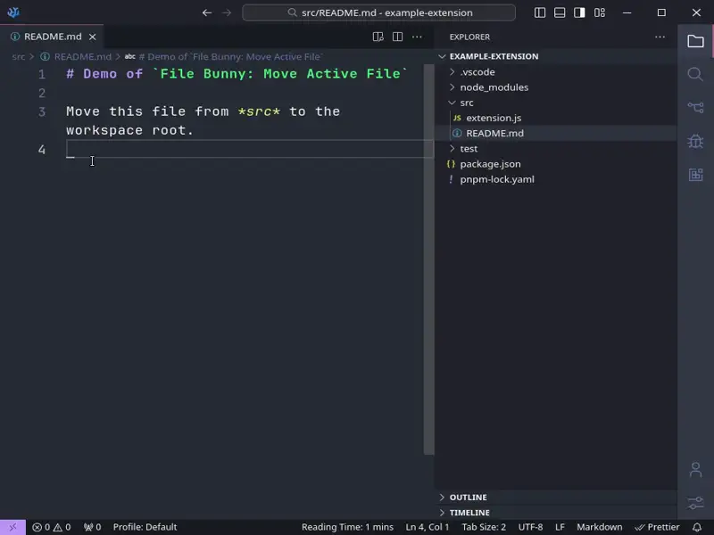
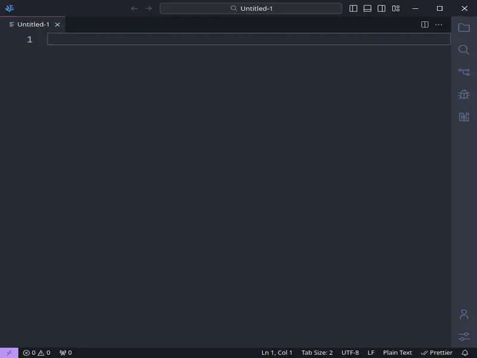
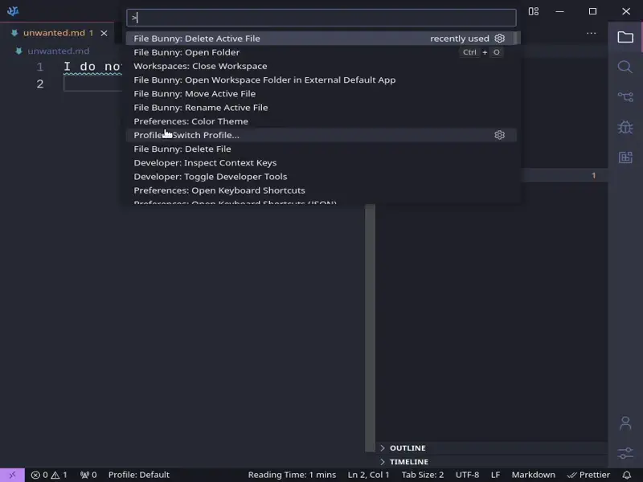
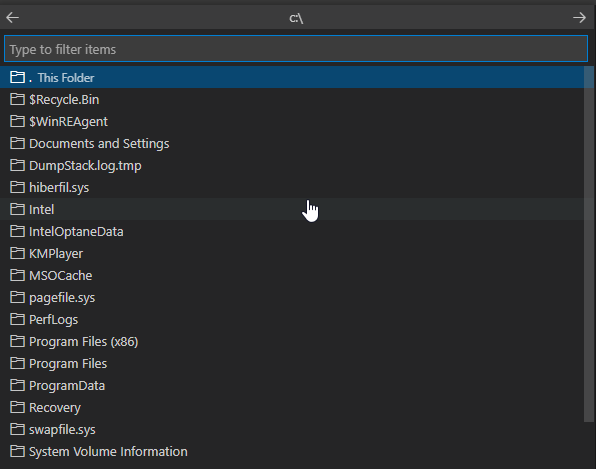
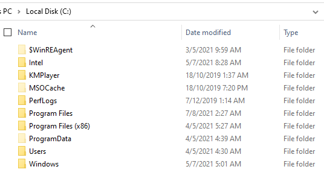

<h1 align="center">
   
    
   
	 
  File Bunny
   
   
</h1>
<h4 align="center">Perform file actions quickly with keyboard-driven file selection. 🐰⌨️</h4>

No need to *hop* to the Sidebar to work with files. 😜

## Consolidated lists for quick file selection

For some file actions, we can consolidate the list of files into a single list for quick selection.

Take the command, `File Bunny: Move Active File`. A QuickPick dialog lets you choose a destination from all folders (and subfolders) in your workspace.

The list is narrowed down to matched selections as you type, the same as with commands in the Command Palette.

You can exclude folders from the list with the `excludes` settings option to keep the list concise.

## Incremental completion to find files quickly

Incremental completion builds a filepath quickly. This is achieved through a QuickPick dialog populated with a file list, and tabbed autocompletion to append each segment.

Take the command, `File Bunny: Open a Folder`. I want to open my *Beer Advisor* Android project, which I know resides in `/home/rob/programming/Workspace/Android/beer-advisor`.

The command opens a dialog by default at `home/rob/programming/Workspace` and I can find the project from there. To find the folder, I type the following:

1. Type "and", which highlights the *Android* folder as the first option. Press `Tab` to select it.
2. Type "bee", which highlights the *beer-advisor* folder as the first option. Press `Tab` to select it.
3. Accept the current directory (first option) by pressing `Enter` to open it.

This process of building paths is quick and far less error-prone than editing a string of the complete filepath. You cannot create an incorrect path.

You can set the default location through the `Filebunny: Starting Location Open Folder` setting.

You can also walk the file system with the arrow keys. Use the left arrow to go back, and right arrow to go forward through the file system if you need to search.

## Actions on the active file

Quite often, you want to do something to a file you're already working on. Why re-find the file in the sidebar to perform an action?

For example, the command  `File Bunny: Delete Active File` will immediately delete the active file (it ends up in the trash).

After the file is deleted, focus is switched to the next open file. This way you can carry on editing without needing to switch view to return to an active state. Other extensions don't do this!

## Destructive actions are safe

If you delete a file, it is sent to the trash (recycle bin).

If you perform a file action such as moving a file, overwriting another file is not possible.

## Open files in default system app

There are times when you want to do something with a workspace file outside of VS Code.

You may want to perform some action on a group of files, so it's probably easier to open that folder in your system file manager and do it there. You can use the `File Bunny: Open Workspace Folder in External Default App` command, or the `File Bunny: Open Folder in External Default App` command to open a specific folder.

You may want to edit a file in an app specific to that file type. For example, I often want to edit SVG files in *Inkscape*, my preferred vector graphics editor. You can use the `File Bunny: Open Active File in External Default App` and `File Bunny: Open File in External Default App` commands to do this.

## Commands

The following commands can be run from the Command Palette (`Ctrl+Shift+P`). They are categorised below:

### File actions on the current workspace

1. `File Bunny: Open File`: Choose a file to open from the current workspace.
1. `File Bunny: Open File to the Right`: Choose a file to open from the current workspace, and split it to the right of the active editor.
1. `File Bunny: Open File to the Left`: Choose a file to open from the current workspace, and split it to the left of the active editor.
1. `File Bunny: Open File Above`: Choose a file to open from the current workspace, and split it above the active editor.
1. `File Bunny: Open File Below`: Choose a file to open from the current workspace, and split it below the active editor.
1. `File Bunny: Open File in External Default App`: Choose a file to open from the current workspace in the system default app.
1. `File Bunny: Create New File`: Create a new file in the current workspace.
1. `File Bunny: Move File`: Choose a file to move to another location in the current workspace.
1. `File Bunny: Duplicate File`: Choose a file to duplicate to another location in the current workspace.
1. `File Bunny: Delete File`: Choose a file to delete from the current workspace. The file is put into the trash (recycle bin).

### File actions on the active file

1. `File Bunny: Open Active File in External Default App`: Open the active file in the system default app.
1. `File Bunny: Move Active File`: Move the active file to another location in the current workspace.
1. `File Bunny: Duplicate Active File`: Copy the active file and place it somewhere in the current workspace.
1. `File Bunny: Rename Active File`: Change the name of the active file.
1. `File Bunny: Delete Active File`: Delete the active file. The file is put into the trash (recycle bin).

### Folder actions

1. `File Bunny: Open Folder`: Choose a folder to open as the workspace.

### Folder actions on the current workspace

1. `File Bunny: Open Workspace Folder in External Default App`: Open the current workspace folder in the system file explorer.
1. `File Bunny: Open Folder in External Default App`: Open a folder from the current workspace in the system file explorer.
1. `File Bunny: Create New Folder`: Create a new folder in the current workspace.
1. `File Bunny: Duplicate Folder`: Duplicate a folder from the current workspace, and place it somewhere in the current workspace.
1. `File Bunny: Delete Folder`: Delete a folder from the current workspace.

### Quick navigation

1. `File Bunny: Go to Top of Active File`: Takes you to the first line of a file.
1. `File Bunny: Go to End of Active File`: Takes you to the last line of a file.

### Quick metadata

1. `File Bunny: Copy File Name`: Copy the file name of the active file to the clipboard.
1. `File Bunny: Copy Relative Path`: Copy the relative file path of the active file to the clipboard.
1. `File Bunny: Copy Absolute Path`: Copy the absolute file path of the active file to the clipboard.

## Settings

- `Filebunny: Excludes`: Configure glob patterns for excluding files and folders from file lists for commands. By default, the *.git* and *node_modules* folders are ignored in your workspace.
- `Filebunny: Starting Location Open Folder`: The initial location shown in the QuickPick when you run the command `File Bunny: Open Folder`. If this field is empty or the path is invalid, it will default to the system home directory.

## Keybindings

For multi-step commands such as `File Bunny: Create New File`, there are keybindings for the *next* and *previous* commands that enable you to go back and forth between steps. These keybindings are only active when you run a multi-step command.

| Keybinding  | Command Name   | Description | When Clause |
|-------------- | -------------- |-------------- |-------------- |
| `➞` (right arrow key)  , or `Tab` for `File Bunny: Open Folder`  | `filebunny.next`    | Skip to next step of a multi-step command | `inFileBunny` |
| `🠔` (left arrow key) | `filebunny.back` | Go back to previous step of a multi-step command | `inFileBunny` |

If you want to modify these keybindings, you can read the [Key Bindings for Visual Studio Code guide](https://code.visualstudio.com/docs/getstarted/keybindings) to learn how.

You can also check out my article, [VS Code keyboard-fu: custom keyboard shortcuts that will boost your productivity](https://www.roboleary.net/2022/02/28/vscode-keyboard-fu-custom-keyboard-shortcuts.html) where I discuss what keybindings I modify.

## Activation

The extension is loaded once VS Code has fully loaded. To be more specific, it is triggered by the `onStartupFinished` [activation event](https://code.visualstudio.com/api/references/activation-events).

## Contribute

If you have a suggestion or find a bug, please file an issue.

If you want to contribute to the development, please discuss it with me first! I do not know when I would have time to perform a code review!

## Appreciate

You can show your appreciation by:
1. [Buying me a coffee or sponsoring me](https://ko-fi.com/roboleary)
1. Leaving a positive review in the [visual studio marketplace](<https://marketplace.visualstudio.com/items?itemName=robole.file-bunny&ssr=false#review-details>).
1. Starring the repo 🌟.

This will **help other people find the extension**.

It will **offer me encouragement** to continue, and can provide **a path to dedicating more time to open-source** in the future.

Thank you! 🙏

## Frequently Asked Questions (FAQ)

### 1) Does File Bunny support multi-root workspaces?

No. I don't use multi-root workspaces, so I have not implemented this feature. If you are interested in this feature, feel free to open an issue and mark it as an "enhancement". If there is enough interest, I will consider implementing it. The current behaviour for a multi-root workspace is that you will only be able to perform actions on the first folder of the workspace.

### 2) When I run the command `File Bunny: Open Folder` on Windows, I see extra folders at *C:*. What's the deal with that?

These are hidden system folders such as the recycle bin. You don't see these in the File Explorer, even if you turn on the "hidden files" setting. They are real files but are always kept hidden from users.

The reason this extension shows them is because it uses [node glob](https://www.npmjs.com/package/glob) under the hood, and glob dutifully reports these back as folders. If you open them, you can't do anything with them because of permissions.

This is not something I can turn off, it is just a quirk with Windows and glob. If it bothers you, add the specific folders to the `Filebunny: Excludes` setting, so that you won't see them in future.
